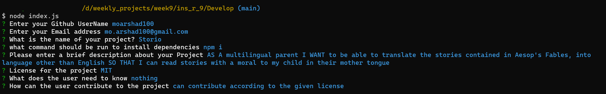

# Professional Readme Generator 
  https://opensource.org/license/gpl-2-0/

  ##  Table of Contents
  * <a name = "description">Description</a>
  * <a name = "License">License</a>
  * <a name = "Contact">Contact</a>

  ## Description
  To create a professional readme for our project. 

  User can contribute to the project as required by the license

  ## Image

  ## License
  You may copy and distribute verbatim copies of the Program’s source code as you receive it, in any medium, provided that you conspicuously and appropriately publish on each copy an appropriate copyright notice and disclaimer of warranty; keep intact all the notices that refer to this License and to the absence of any warranty; and give any other recipients of the Program a copy of this License along with the Program.

  ## Contact
  * [E-mail]mo.arshad100@gmail.com
  * [Github]https://github.com/moarshad100

